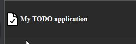
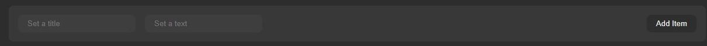
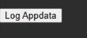
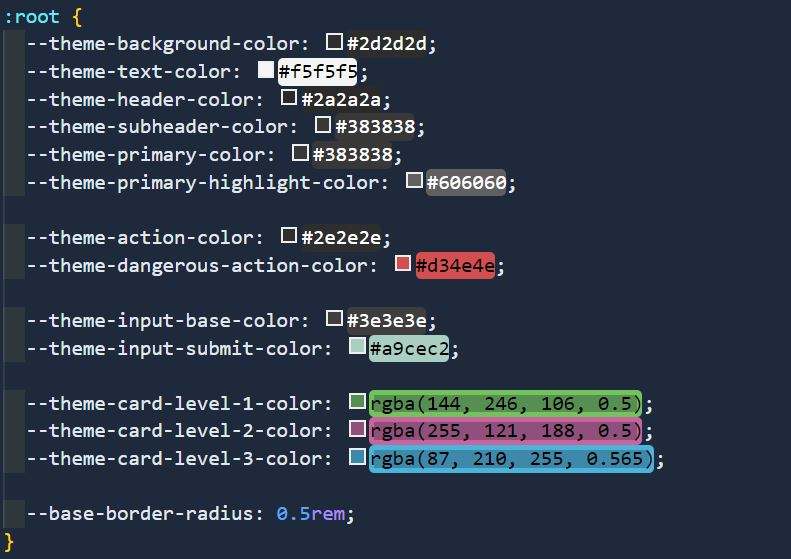

# ReadME
### Kommandon i kod (VSCODE)
alt + pilar (upp | ner ) för att flytta rad ni står på upp | ner

### Dagens uppgifter & morgondagens
## 2022-12-19 & 2022-12-20

- **Header** med en Logo-typ som ska förbättras
  #1. Rita en design i Figma med en ikon (rita eller importera)
  #2. Snygga till text 
  #3. Implementera i HTML & CSS

  

- Kort / TodoItem
  #1. Rita en design i Figma
  #2. Implementera i CSS (denna har vi skapat dynamiskt via JS)

  

- Add Item knapp & Formulär
  #1. Skapa knapp för Add Item & ett Formulär. 
    - Vi har 'Title' & 'Text' där som vi hämtar, (Tänk på att funktionen måste ändras i båda fall)
  #2. Lägg till så man kan skicka med colorIndex(1-3), alltså en input för färg

 

  Extra:
  Använda input "color-picker"
  https://developer.mozilla.org/en-US/docs/Web/HTML/Element/input/color

- Ta bort vår knapp för Log AppData, (funktionen kan ligga kvar)

  

- Hämta in ett snyggare typsnitt, alltså en Font (valfri)

- Justera färger

  

  #1. Justera färger, eventuellt lägga in lite egna i :root (alltså egna variabler)
    - Variablernas värde, går att skriva som 0.5rem etc.
  #2. Behöver ni styra fler variabler som standard i er CSS? (Analysera vad som återanvänds)

#### **Extra för de som hinner med en del:**
#1. AddItem-formulär kan flyttas till en ny sida, alltså man navigerar till en ny HTML-sida där
förmulär återfinns.
  - Efter skickat AddItem ska man åka tillbaka till huvudsidan och se sitt nyligen tillagda TodoItem i listan

#2. Snygga till koden, extrahera funktionalitet till separata funktioner
