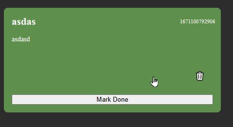

# ReadME
### Kommandon i kod (VSCODE)
alt + pilar (upp | ner ) för att flytta rad ni står på upp | ner

### Dagens uppgifter & morgondagens
## 2022-12-19 & 2022-12-20

- **Header** med en Logo-typ som ska förbättras
  1. Rita en design i Figma med en ikon (rita eller importera)
  2. Snygga till text 
  3. Implementera i HTML & CSS

  

  Exempel
  

- **Kort / TodoItem**
  1. Rita en design i Figma
  2. Implementera i CSS (denna har vi skapat dynamiskt via JS)

  

  Exempel
  

- **Add Item knapp & Formulär**

  Vi har redan 'Title' & 'Text' som vi hämtar från våra input.
  
  - Lägg till så man kan skicka med colorIndex(1-3), alltså <input type="number"> för färg
  (Tänk på att funktionen i vår JavaScript också måste ändras)
https://developer.mozilla.org/en-US/docs/Web/HTML/Element/input/number

  Extra:
  Använda input "color-picker"
  https://developer.mozilla.org/en-US/docs/Web/HTML/Element/input/color

- Ta bort vår knapp för **Log AppData**, (funktionen kan ligga kvar)

  

- Hämta in ett snyggare typsnitt, alltså en **Font** (valfri)

  

- Justera färger, eventuellt lägga in lite egna i :root (alltså egna variabler). 
  - Variablernas värde, går att skriva som 0.5rem etc.
- Behöver ni styra fler variabler som standard i er CSS? (Analysera vad som återanvänds)

#### **Extra för de som hinner:**
- AddItem-formulär kan flyttas till en ny sida, alltså man navigerar till en ny HTML-sida där
förmulär återfinns. 
    Efter skickat AddItem ska man åka tillbaka till huvudsidan och se sitt nyligen tillagda TodoItem i listan

-  Snygga till koden, extrahera funktionalitet till separata funktioner
- Lägg över våra elements i vårt App.elements-objekt, referera på alla ställen
